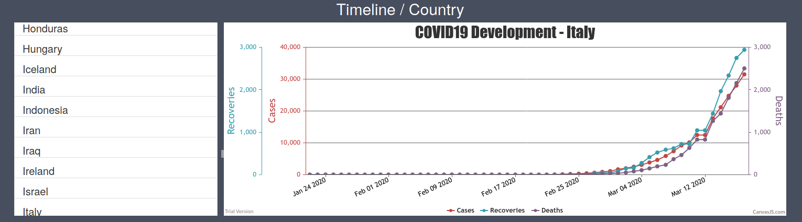
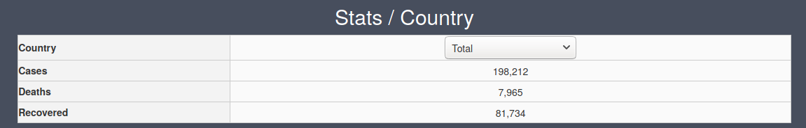
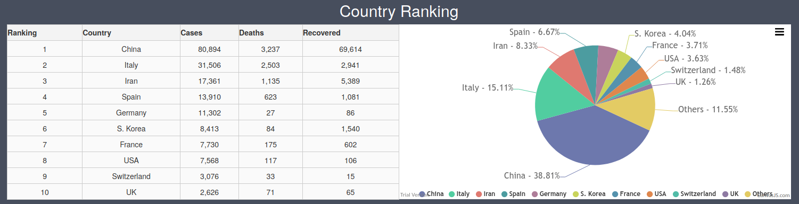
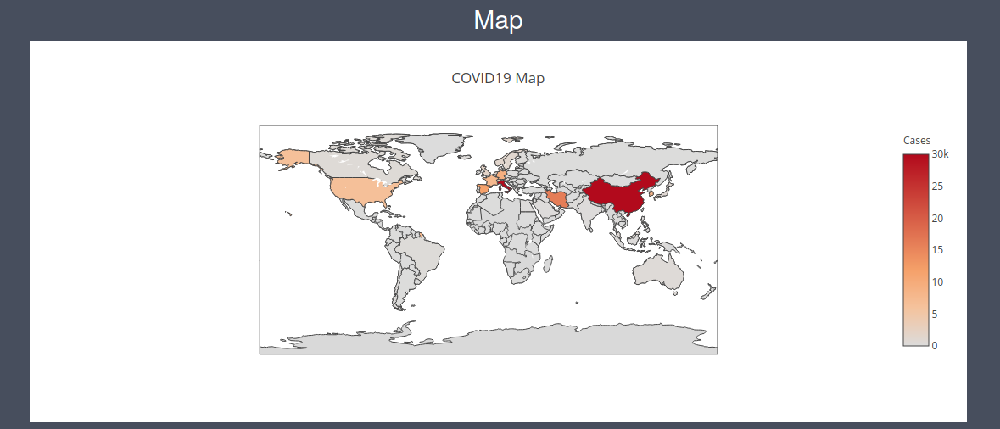
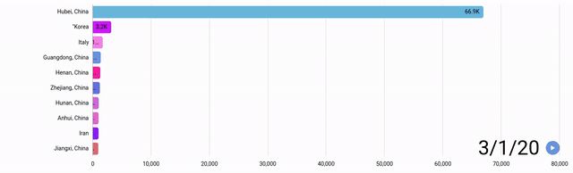
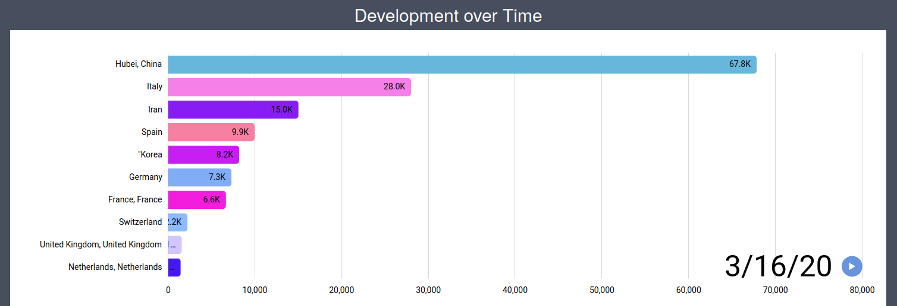

# COVID19 Tracker
COVID19 Tracker: http://lukas-graber.tk/projects/covid19_tracker.html  
Demonstration: http://lukas-graber.tk/projects/covid19_tracker_demonstration.html  

## Description
This web application serves as a real-time tracker for COVID19. The data is pulled from several APIs and uses multiple different views on the numbers. The data is represented as a timeseries, as well as most recent data for the different countries. Furthermore the 10 countries with the highest number of Corona cases are listed. A world map shows the spreading of the virus.

## Pictures
### Timeline / Country

### Stats / Country
  

### Country Ranking
  

### Map
  

### Development over Time

